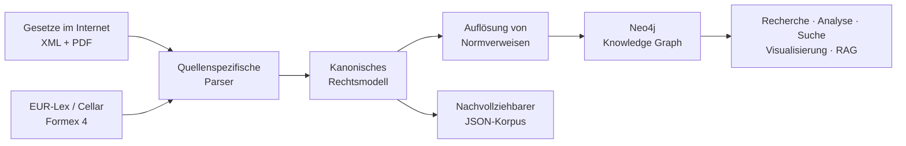

# RechtsGraph

### German and EU law as connected, queryable data

RechtsGraph verwandelt konsolidierte deutsche und europäische Gesetzestexte in
einen navigierbaren Knowledge Graph. Statt Rechtsnormen nur als einzelne
Dokumente abzulegen, macht das Projekt ihre innere Struktur und ihre
gegenseitigen Verweise explizit: von Gesetzen und Verordnungen über Paragraphen,
Artikel und Absätze bis hin zu Tabellen, Anhängen und dokumentübergreifenden
Referenzen.

Das Ergebnis ist eine belastbare Datenschicht für juristische Recherche,
Netzwerk- und Folgenanalysen, spezialisierte Suchsysteme und – als eine mögliche
Anwendung – GraphRAG.


*Ein Ausschnitt des Knowledge Graph in Neo4j: Rechtsakte und ihre Struktureinheiten bilden ein dicht verknüpftes Netzwerk.*

## Die Idee

Gesetze werden dokumentweise veröffentlicht, funktionieren aber als Netzwerk.
Ein Paragraph verweist auf einen anderen, eine deutsche Verordnung konkretisiert
ein Gesetz, eine nationale Norm setzt europäische Vorgaben um. Wer nur Volltext
durchsucht, sieht einzelne Fundstellen. Wer die Beziehungen modelliert, kann das
Rechtssystem als zusammenhängende Struktur untersuchen.

RechtsGraph entstand aus der Frage, wie sich dieses Netzwerk automatisiert
erschließen lässt, ohne den juristischen Text auf undurchsichtige LLM-Extraktion
oder beliebige Textblöcke zu reduzieren. Die Pipeline arbeitet deshalb
deterministisch, quellenbewusst und strukturerhaltend.

## Was RechtsGraph ermöglicht

- **Abhängigkeiten nachvollziehen:** Welche Normen verweisen auf ein Gesetz,
  einen Artikel oder eine EU-Richtlinie?
- **Änderungsfolgen erkunden:** Welche Teile des Rechtsnetzes könnten von einer
  geänderten Vorschrift berührt sein?
- **Deutsches und europäisches Recht verbinden:** Nationale und europäische
  Rechtsakte lassen sich über ihre konkreten Verweise gemeinsam betrachten.
- **Strukturiert recherchieren:** Inhalte können auf Dokument-, Norm-, Absatz-,
  Tabellen- oder Chunk-Ebene adressiert werden.
- **Eigene Anwendungen aufbauen:** Der Graph kann als Grundlage für Suche,
  Visualisierungen, Datenanalysen, APIs oder Retrieval-Systeme dienen.

Der Knowledge Graph ist damit kein bloßer Zwischenschritt für einen Chatbot. Er
ist ein eigenständig nutzbares Datenmodell des deutschen und europäischen
Rechtsbestands.

## Von der Quelle zum Graphen



Für den deutschen Bestand nutzt die Pipeline primär die XML-Fassungen von
*Gesetze im Internet*. PDFs ergänzen Seitenbelege und dienen als visuelle
Referenz. Konsolidierte EU-Rechtsakte werden über Cellar bezogen und aus Formex
4 verarbeitet. Eindeutig referenzierte EU-Verordnungen, für die keine
konsolidierte Fassung im Bestand liegt, ergänzt die Standardpipeline aus den
amtlichen Originalfassungen; andere externe Dokumentarten bleiben außen vor.
Beide Quellen werden in dasselbe Modell aus `Document`, `StructuralUnit` und
`Chunk` übersetzt, bevor Referenzen aufgelöst und die Daten nach Neo4j
exportiert werden.

## Was technisch interessant ist

### Struktur statt Plain Text

Überschriften, Paragraphen, Artikel, Absätze, Listen, Fußnoten, Anhänge und
Tabellen bleiben als eigenständige, adressierbare Einheiten erhalten. Dadurch
geht beim Übergang von XML zu JSON und Graph nicht verloren, an welcher Stelle
eine Aussage im Rechtsakt steht.

### Tabellen als First-Class Data

Juristische Tabellen sind häufig komplexer als normale HTML-Tabellen: mehrstufige
Kopfzeilen, verbundene Zellen, Fußnoten und sehr lange Zeilen sind üblich.
RechtsGraph erhält diese Struktur und teilt nur große Tabellen in
retrieval-taugliche Segmente. Tabellen- und Spaltenüberschriften werden dabei in
jedem Teilstück mitgeführt.

### Nachvollziehbare Referenzen

Normverweise werden regelbasiert erkannt und auf konkrete Dokumente oder
Struktureinheiten geschlossen. Ziele außerhalb des Korpus verschwinden nicht,
sondern bleiben als offene, prüfbare Referenzen erhalten. So lässt sich
unterscheiden, ob eine Kante im Graphen geschlossen wurde oder auf eine externe
Quelle zeigt.

### Reproduzierbare Datenpipeline

Downloads und Verarbeitungsschritte sind resumierbar, IDs stabil und Exporte
idempotent. Korpusaudits prüfen unter anderem Hierarchie, Eindeutigkeit,
Quellbezug und Tabellenstruktur. Mehr als 200 automatisierte Tests decken unter
anderem besonders schwierige Gesetzestabellen und die Kompatibilität der
deutschen und europäischen Parser ab.

## Größenordnung

Der aktuelle Build verbindet mehr als 11.000 konsolidierte deutsche und
europäische Rechtsakte. In Neo4j entstehen daraus rund 1,4 Millionen Knoten und
4,4 Millionen Beziehungen. Der vollständige Korpus und die generierten
Importdateien werden wegen ihrer Größe nicht im Repository versioniert; hier
liegen die Parser, Pipelines, Tests und Exportwerkzeuge.

## Beispiel: Verbindungen statt Trefferlisten

Eine klassische Volltextsuche beantwortet die Frage, wo ein Begriff vorkommt.
Der Graph kann stattdessen Beziehungen liefern – beispielsweise eine Auswahl
von Rechtsakten, die direkt aufeinander verweisen:

```cypher
MATCH (source:Document)-[:REFERS_TO]->(target:Document)
RETURN source.title AS source,
       target.title AS target
LIMIT 25;
```

Dasselbe Modell erlaubt Traversierungen über mehrere Ebenen: vom Dokument zum
Artikel, vom Artikel zum Textabschnitt und von dort zu einer referenzierten Norm
in einem anderen Rechtsakt.


*Im Detail werden die innere Struktur eines Rechtsakts und seine Verweise sichtbar.*

## Repository

```text
RechtsGraph/
├── pdf-neo4j-pipeline/
│   ├── normtext_extractor/   # Parser und gemeinsames Datenmodell
│   ├── scripts/              # Download-, Batch-, Audit- und Export-Workflows
│   ├── tests/                # Unit-, Integrations- und Regressionstests
│   └── requirements.txt
├── gesetze_im_internet_pdfs/ # Platzhalter für den lokalen GII-PDF-Korpus
├── eurlex_consolidated_de/   # Platzhalter für lokale Cellar-Downloads
└── external_documents/      # Register und lokale amtliche Originalfassungen
```

Die wichtigsten Bausteine sind:

- ein GII-Adapter für deutsches XML inklusive CALS-Tabellen,
- ein Formex-Adapter für konsolidiertes EU-Recht und Originalverordnungen,
- eine gemeinsame Content-Graph-Repräsentation,
- dokumentübergreifende Referenzauflösung,
- JSON-, CSV- und Cypher-Exporte für Neo4j,
- Audits und Renderer zur strukturellen und visuellen Kontrolle.

## Lokal starten

Vorausgesetzt werden Python 3.9 oder neuer und – für den Graphimport – eine
laufende Neo4j-Instanz.

```bash
git clone https://github.com/flyingpinguu/RechtsGraph.git
cd RechtsGraph/pdf-neo4j-pipeline

python3 -m venv .venv
./.venv/bin/python -m pip install --upgrade pip
./.venv/bin/python -m pip install -r requirements.txt
./.venv/bin/python -m pytest
```

Die Batch-Skripte unter `scripts/` führen anschließend durch Download,
Normalisierung, Audit, Referenzauflösung und Neo4j-Export. Quelldaten und
generierte Korpora bleiben bewusst außerhalb der Versionsverwaltung; die
erwarteten lokalen Quellverzeichnisse sind im Repository als Platzhalter
angelegt.

### Optionaler Zugriff für Agenten

Ein schlanker MCP-Server stellt den lokalen Korpus bestehenden Agenten-Hosts
wie Codex als Werkzeugsammlung bereit. Er ist kein eigener Agenten-Loop und
erzwingt keine feste Recherchelogik: Der aufrufende Agent kann Dokumente und
Normeinheiten gezielt öffnen, Volltextkontext suchen, Verweiskanten erkunden
und diese Quellen frei mit eigener Webrecherche kombinieren.

Der Suchindex wird aus den kanonischen JSON-Korpora abgeleitet; XML, JSON und
Neo4j bleiben die maßgeblichen Datenquellen. Sonderdokumente ohne eigenen
Strukturparser werden nur nach expliziter Auswahl seiten- und tokenbewusst als
PDF-Passagen aufgenommen.

```bash
python3.11 -m venv .venv-mcp
./.venv-mcp/bin/python -m pip install -r requirements-mcp.txt
./.venv-mcp/bin/python scripts/build_retrieval_index.py \
  --external-document-id adr_2025 \
  --external-document-id adr_2025_changes_de
./.venv-mcp/bin/python -m rechtsgraph_mcp.server
```

Ein lokaler Agent Debugger setzt den MCP-Server über den Codex App Server in
einen vollständigen Rechercheloop ein. Er zeigt Modellrunden, Toolpfade,
Token- und Cacheverbrauch, Resultatgrößen und automatische Bloat-Hinweise. Runs
werden unter `output/debug_ui/runs` persistent protokolliert und bleiben nach
einem Neustart auswertbar.

```bash
cd pdf-neo4j-pipeline/debug_ui
npm start                 # schlankes RechtsGraph-Rechercheprofil
npm run start:full        # vollständiges Codex-Profil für Entwicklung
```

## Tech Stack

`Python` · `XML / DTD` · `Formex 4` · `JSON` · `SQLite FTS5` · `MCP` ·
`Neo4j` · `Cypher` · `PyMuPDF` · `pypdf` · `pytest`

## Nächste Schritte

- visuelle Einblicke in Graph, Tabellen und Pipeline ergänzen,
- einen interaktiven Explorer für Rechtsakte und Verweisketten entwickeln,
- Such- und Analysezugriffe über eine schlanke API bereitstellen,
- Retrieval-Strategien auf Basis von Volltext, Struktur und Graph vergleichen.

## Datenquellen und Einordnung

RechtsGraph ist ein eigenständiges Legal-Data-Engineering-Projekt und keine
Rechtsberatung. *Gesetze im Internet* stellt konsolidierte, nicht amtliche
Fassungen bereit; für die amtliche Verkündung deutscher Normen ist das
Bundesgesetzblatt maßgeblich. Für EU-Rechtsakte nutzt das Projekt konsolidierte
deutsche Fassungen aus EUR-Lex beziehungsweise Cellar.
